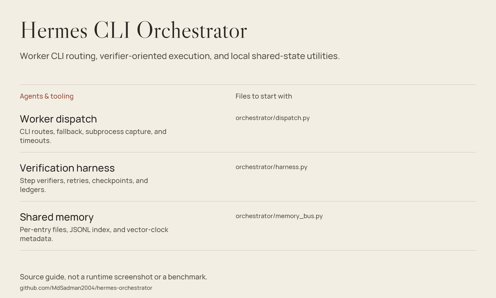

# Hermes Orchestrator — CLI Worker Dispatch & Execution Utilities



*Source guide drawn from the files in this repository; not a runtime screenshot or a fresh benchmark.*

**Python scripts for routing tasks to installed CLI workers and recording execution state.**
The repository includes a node registry, subprocess dispatch with fallback,
a verifier-oriented harness, shared-memory files, and cron inspection tools.
It is a custom integration layer around external agent CLIs, not the Hermes
runtime itself and not a FastAPI swarm service.

## Included capabilities

| Utility | Implemented behavior |
|---|---|
| Dispatch | Select registry entries by task kind, invoke their command templates, capture output, and try fallback nodes. |
| Process bounds | Apply subprocess timeouts; use Windows `taskkill /T` on timeout. |
| Execution harness | Require a verifier, journal attempts, checkpoint completed steps, classify failures, and stop repeated failures. |
| Shared memory | Write per-entry Markdown plus a JSONL index and vector-clock metadata. |
| Prompt matching | Match trigger text against a separately supplied prompt library. |
| MCP export | Convert enabled command-based server definitions from local Hermes YAML to `.mcp.json`. |
| Cron tools | Inspect failure streaks and execution records; optionally disable jobs at a configured streak. |

## Getting started

Use **Python 3.10+**. The core dispatch/listing path uses the standard library.
There is no package installer or `requirements.txt` in this checkout.

```bash
git clone https://github.com/MdSadman2004/hermes-orchestrator.git
cd hermes-orchestrator
python orchestrator/dispatch.py --help
python orchestrator/dispatch.py --list
```

`--list` reads the bundled registry; it does **not** establish that those
binaries, accounts, models, or historical `verified` flags work on your machine.

Before dispatching:

1. Install and authenticate the desired worker CLI separately.
2. Review `orchestrator/nodes.json`: binaries, flags, permissions, and cost hints
   are host-specific examples, not a portable entitlement to a free model.
3. Set an explicit working directory and a bounded timeout.
4. Inspect each worker's permission settings before giving it real source files.

Once configured, the dispatch parser accepts:

```bash
python orchestrator/dispatch.py --task "Summarize the README only" --kind summarize --cwd . --timeout 120 --json
```

This invokes an external agent and can consume credits or modify files,
depending on its configured permissions. `--probe` also invokes workers and
rewrites the registry; it is not a read-only installation check.

## Optional integrations

- `mcp_export.py` requires **PyYAML** and a local Hermes `config.yaml`.
  Its implemented output is `.mcp.json`; the header's other format claims
  do not imply an OpenCode exporter is included.
- `prompt_router.py` and `worker_brief.py` require
  `orchestrator/prompt_library.json`, which is **not bundled**.
- Memory, harness, and sentinel paths use `HERMES_HOME` or default to `D:\.hermes`.
  Configure a disposable home before experimenting with state-writing modules.
- `cron_guard.py` has hardcoded `D:\.hermes` job/log paths and can disable live jobs.
  It does not have a dry-run option; do not treat it as a harmless demo.

## Source guide

| File | Purpose |
|---|---|
| [Dispatcher](orchestrator/dispatch.py) | Actual CLI, route preferences, fallback, and timeout handling. |
| [Node registry](orchestrator/nodes.json) | Command templates and historical probe metadata. |
| [Harness](orchestrator/harness.py) | Step/verifier API, retry logic, checkpoints, and ledger. |
| [Memory bus](orchestrator/memory_bus.py) | Append operations, reads, and vector-clock comparison. |
| [Prompt router](orchestrator/prompt_router.py) | Trigger matching against an external JSON library. |
| [Worker brief](orchestrator/worker_brief.py) | Brief generation requiring that same missing library. |
| [MCP exporter](orchestrator/mcp_export.py) | YAML input and supported output schema. |
| [Cron sentinel](cron/cron_sentinel.py) | Read-oriented fleet findings from jobs and SQLite records. |
| [Cron guard](cron/cron_guard.py) | State-changing job-disable operation. |

## Scope & limitations

- No REST server, priority queue, RAM governor, or `orchestrator.swarm` exists here.
- Default worker flags can already grant tool or edit permissions;
  omitting `--yolo` is not a universal guarantee of interactive approval.
- Non-Windows timeout handling kills the direct child, not a guaranteed process tree.
- The harness checks its elapsed deadline after a callable returns;
  it does not interrupt a hung callable. Actions must enforce their own timeouts.
- Resuming the harness trusts checkpoint entries marked `ok` and skips those
  steps without re-running their verifiers; changed or missing outputs can go unnoticed.
- Shared-memory clock/index updates are not locked; vector-clock metadata
  does not make concurrent filesystem writes transactional or conflict-free.
- Historical node probes and comments are recorded context, not a fresh
  verification of worker availability. No agents, cron jobs, or tests were run here.

## License

[MIT License](LICENSE), copyright 2026 Md Sadman Bin Masud.
