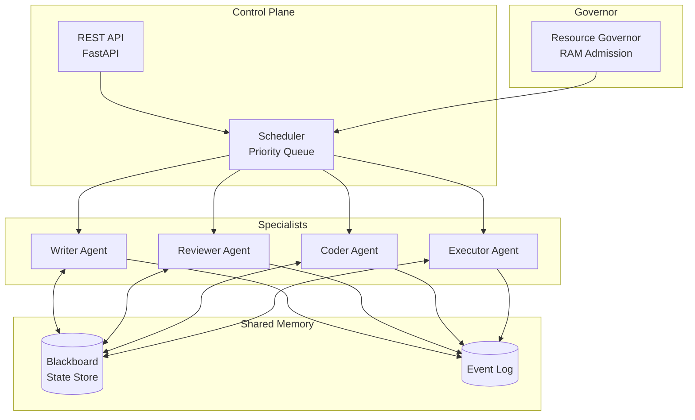

**Multi-agent orchestration for Hermes — coordinate specialized AI agents across a swarm.**

---

## 🏗️ Architecture



---

## ✨ Features

- **Specialist agents** — writer, reviewer, coder, executor with distinct tool sets
- **Shared blackboard** — agents read/write common state for coordination
- **Resource governor** — RAM-based admission control to prevent OOM
- **Event logging** — full audit trail of agent actions and decisions
- **Priority scheduling** — critical tasks jump the queue

---

## 🚀 Quick Start

```bash
pip install -r requirements.txt
python -m orchestrator.swarm --scale x --profile default
```

---

## 📁 Project Structure

```
hermes-orchestrator/
├── orchestrator/
│   ├── swarm.py           # Main swarm orchestrator
│   ├── scheduler.py       # Priority queue + dispatch
│   ├── blackboard.py      # Shared state store
│   ├── governor.py        # Resource governor
│   ├── agents/            # Specialist agent implementations
│   └── log.py             # Event logging
├── tests/
└── README.md
```

---

## 📄 License

MIT © Md Sadman Bin Masud
